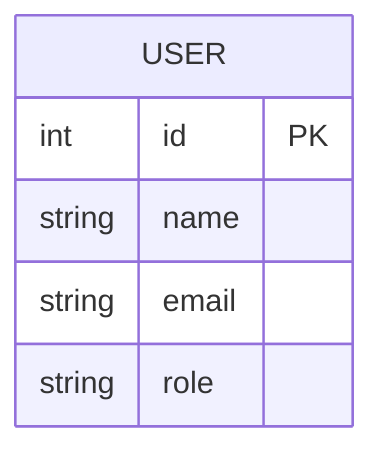
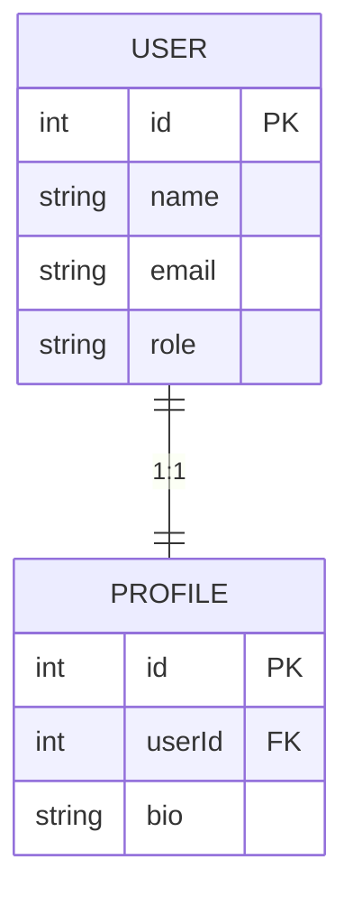
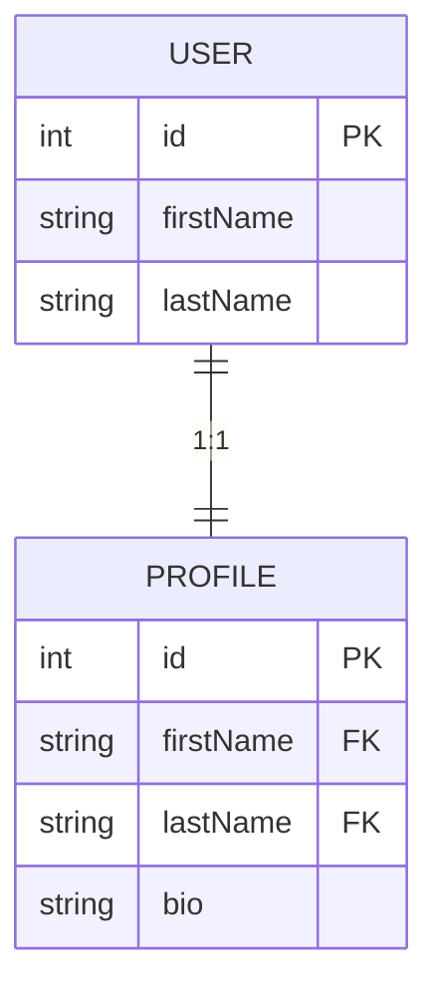
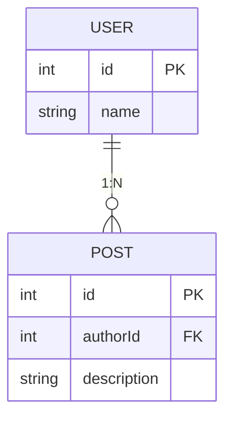
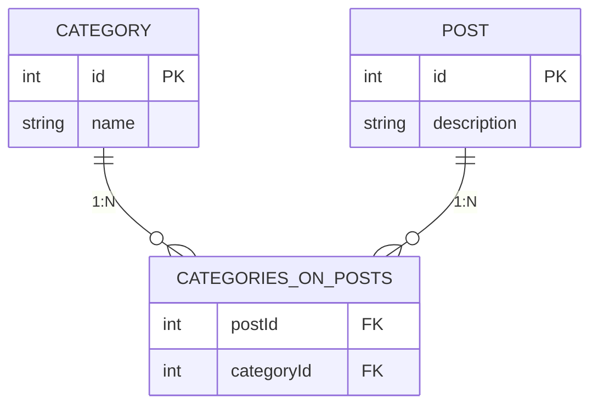
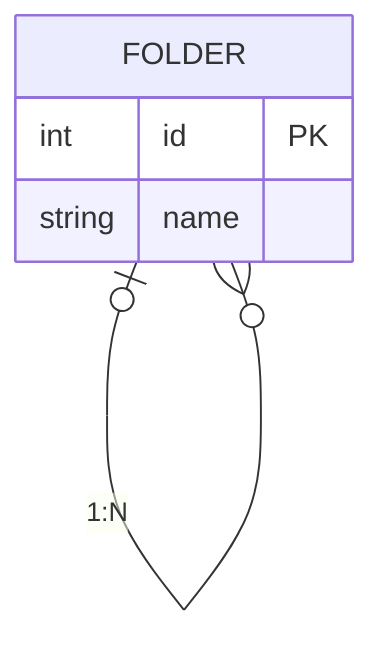
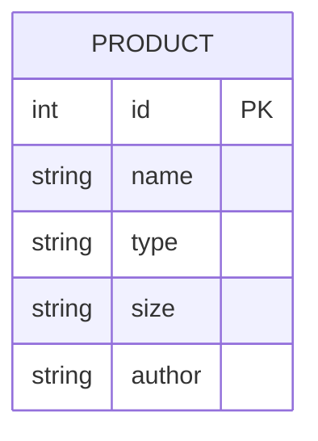

# 📖 Examples

This guide describes how to define a factory according to relation types.  
If you want to check the actual code that work with the [Drizzle ORM](https://orm.drizzle.team/), it is located in the [example directory](./examples/basic).

> [!NOTE]  
> If you plan to use factory-js with Prisma, you don't need to define factories yourself.  
> You can generate factories automatically from the schema file by using [@factory-js/prisma-factory](https://github.com/factory-js/factory-js#-with-prisma).

## No Relation

This is the simplest case. You can define a factory with `.define`.



```typescript
const userFactory = factory.define(
  {
    props: {
      name: () => faker.string.alphanumeric(40),
      email: () => faker.internet.exampleEmail(),
      role: () => faker.helpers.arrayElement(["guest", "admin"] as const),
    },
    vars: {},
  },
  (props) => create(users, props),
);

describe("when a user is admin", () => {
  it("returns true", async () => {
    const user = await userFactory.props({ role: () => "admin" }).create();
    await expect(isAdmin(user.id)).resolves.toBe(true);
  });
});
```

## One-to-One

If the model has any relation, you can define related models in `.vars` and then refer to their IDs in `.props`.  
The following example creates a user and its profile.  
For detailed information about `.vars` and `.props`, please refer to the [API section](https://github.com/factory-js/factory-js#-api).



```typescript
const userFactory = factory.define(
  {
    props: {
      name: () => faker.string.alphanumeric(40),
      email: () => faker.internet.exampleEmail(),
      role: () => faker.helpers.arrayElement(["guest", "admin"] as const),
    },
    vars: {},
  },
  (props) => create(users, props),
);

const profileFactory = factory
  .define(
    {
      props: {
        userId: later<number>(),
        bio: () => faker.string.alphanumeric(40),
      },
      vars: {
        user: () => userFactory.create(),
      },
    },
    (props) => create(profiles, props),
  )
  .props({
    userId: async ({ vars }) => (await vars.user).id,
  });

describe("when a user exists", () => {
  it("returns the user profile", async () => {
    const user = await userFactory.create();
    const profile = await profileFactory.vars({ user: () => user }).create();
    await expect(getProfile(user.id)).resolves.toStrictEqual({
      name: user.name,
      bio: profile.bio,
    });
  });
});
```

Alternatively, you can specify the default user ID directly within `.define` instead of using `.vars`, like this:

```typescript
const profileFactory = factory.define(
  {
    props: {
      userId: async () => (await userFactory.create()).id,
      bio: () => faker.string.alphanumeric(40),
    },
    vars: {},
  },
  (props) => create(profiles, props),
);
```

However, considering multiple foreign keys, we generally recommend using `.vars`.  
In the following example, the profile has two foreign keys: `firstName` and `lastName`.  
In this case, you need to use `.vars` to obtain foreign keys from the **same** user.



```typescript
const userFactory = factory.define(
  {
    props: {
      firstName: () => faker.person.firstName(),
      lastName: () => faker.person.lastName(),
    },
    vars: {},
  },
  (props) => create(users, props),
);

const profileFactory = factory
  .define(
    {
      props: {
        firstName: later<string>(),
        lastName: later<string>(),
        bio: () => faker.string.alphanumeric(40),
      },
      vars: {
        user: () => userFactory.create(),
      },
    },
    (props) => create(profiles, props),
  )
  .props({
    firstName: async ({ vars }) => (await vars.user).firstName,
    lastName: async ({ vars }) => (await vars.user).lastName,
  });
```

## One-to-Many

You can define one-to-many relations in the same way as one-to-one relations.  
In the example, a user can have multiple posts.



```typescript
const userFactory = factory.define(
  {
    props: {
      name: () => faker.string.alphanumeric(40),
    },
    vars: {},
  },
  (props) => create(users, props),
);

const postFactory = factory
  .define(
    {
      props: {
        authorId: later<number>(),
        description: () => faker.string.alphanumeric(40),
      },
      vars: {
        author: () => userFactory.create(),
      },
    },
    (props) => create(posts, props),
  )
  .props({
    authorId: async ({ vars }) => (await vars.author).id,
  });

describe("when an author has posts", () => {
  it("returns the count", async () => {
    const author = await userFactory.create();
    await postFactory.vars({ author: () => author }).createList(3);
    await expect(getPostCount(author.id)).resolves.toBe(3);
  });
});
```

## Many-to-Many

If the model has a many-to-many relations, you may need to create a junction model.  
In this situation, you can optionally manage the code that creates a junction model with `.traits`.



```typescript
const postFactory = factory.define(
  {
    props: {
      description: () => faker.string.alphanumeric(40),
    },
    vars: {},
  },
  (props) => create(posts, props),
);

export const categoryFactory = factory
  .define(
    {
      props: {
        name: () => faker.string.alphanumeric(40),
      },
      vars: {},
    },
    (props) => create(categories, props),
  )
  .traits({
    withPost: (post: Post) => ({
      after: async (category) => {
        await categoriesOnPostsFactory
          .vars({ post: () => post, category: () => category })
          .create();
      },
    }),
  });

const categoriesOnPostsFactory = factory
  .define(
    {
      props: {
        postId: later<number>(),
        categoryId: later<number>(),
      },
      vars: {
        post: () => postFactory.create(),
        category: () => categoryFactory.create(),
      },
    },
    (props) => create(categoriesOnPosts, props),
  )
  .props({
    postId: async ({ vars }) => (await vars.post).id,
    categoryId: async ({ vars }) => (await vars.category).id,
  });

describe("when a post has categories", () => {
  it("returns category names", async () => {
    const post = await postFactory.create();
    await categoryFactory
      .use((t) => t.withPost(post))
      .props({ name: () => "food" })
      .create();
    await expect(getCategoryNames(post.id)).resolves.toStrictEqual(["food"]);
  });
});
```

## Self Relation

There is no particular technique required to define a self-relation.  
The following example demonstrates how to create a root folder and its child folders.



```typescript
const folderFactory = factory
  .define(
    {
      props: {
        name: () => faker.string.alphanumeric(40),
        parentId: later<number | null>(),
      },
      vars: {
        parent: (): Folder | undefined => undefined,
      },
    },
    (props) => create(folders, props),
  )
  .props({
    parentId: async ({ vars }) => (await vars.parent)?.id ?? null,
  });

describe("when a folder has children", () => {
  it("returns the folder tree", async () => {
    const parent = await folderFactory.create();
    const children = await folderFactory
      .vars({ parent: () => parent })
      .createList(2);
    await expect(getChildFolders(parent.id)).resolves.toStrictEqual([
      { name: children[0]?.name, children: [] },
      { name: children[1]?.name, children: [] },
    ]);
  });
});
```

## STI

[Single-table inheritance](https://www.prisma.io/docs/orm/prisma-schema/data-model/table-inheritance#single-table-inheritance-sti) is the design pattern used to implement table inheritance.  
As a best practice, it is recommended to use `.traits` to effectively manage inheritances.



```typescript
type Size = "small" | "medium" | "large";

export const productFactory = factory
  .define(
    {
      props: {
        name: () => faker.string.alphanumeric(40),
        type: later<"book" | "clothing">(),
        size: (): Size | null => null, // "clothing" only
        author: (): string | null => null, // "book" only
      },
      vars: {},
    },
    (props) => create(products, props),
  )
  .traits({
    book: {
      props: {
        type: () => "book",
        author: () => faker.string.alphanumeric(40),
      },
    },
    clothing: {
      props: {
        type: () => "clothing",
        size: () => rand(["small", "medium", "large"]),
      },
    },
  });

describe("when a product type is the book", () => {
  it("returns the book", async () => {
    const book = await productFactory.use((t) => t.book).create();
    await expect(getProduct(book.id)).resolves.toStrictEqual({
      author: book.author,
      name: book.name,
    });
  });
});
```
