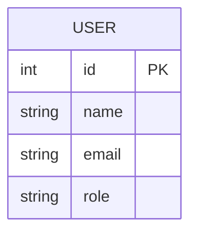
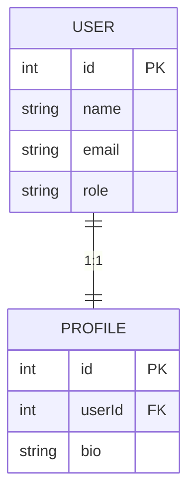
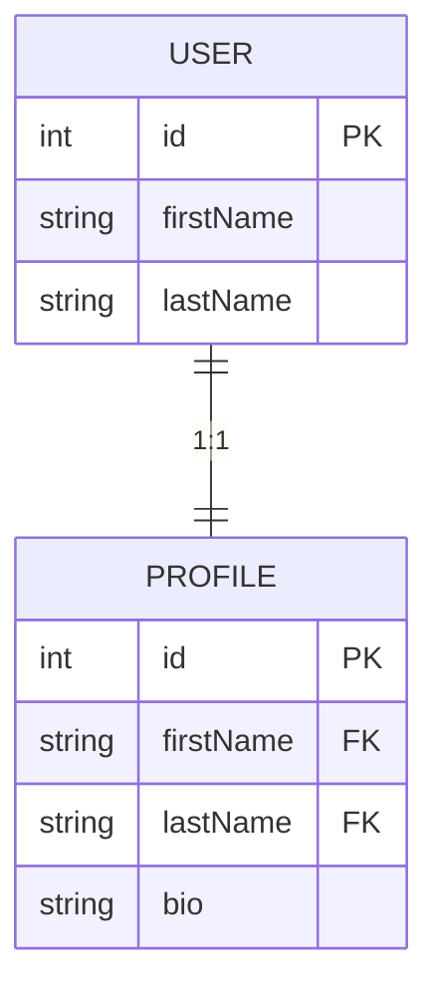
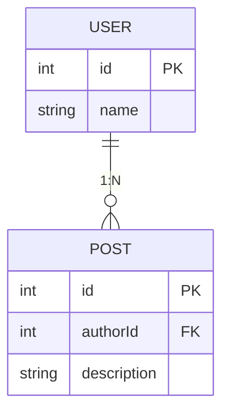
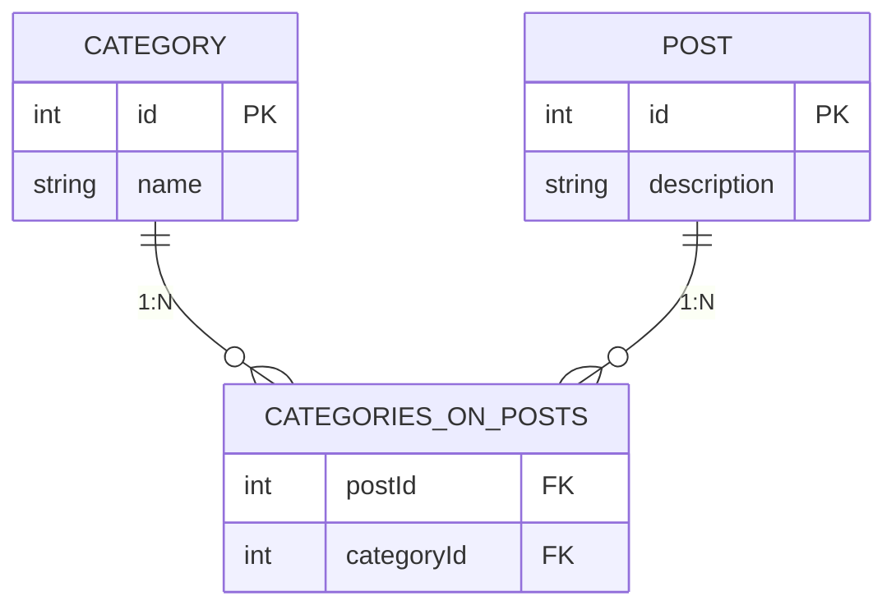
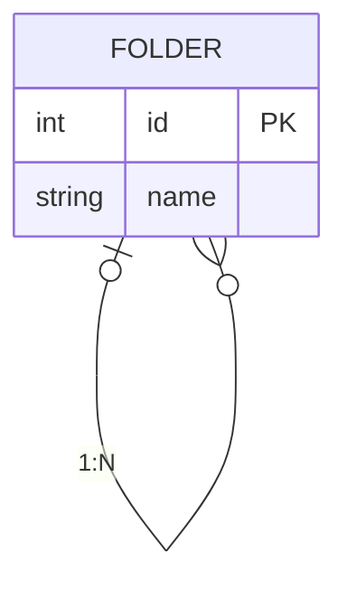
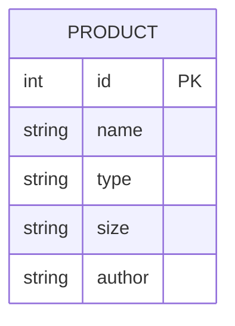

<p align="center"></p>
<h1 align="center">factory-js</h1>
<p align="center">🏭 The ORM-agnostic object generator for testing<p>
<p align="center"><a href="https://codecov.io/gh/factory-js/factory-js"></a> <a href="https://bundlephobia.com/package/@factory-js/factory"></a>
<p>

## 🚀 Features

- 🔌&nbsp;&nbsp;**ORM Agnostic** - Can be used with Prisma and more!
- 🥰&nbsp;&nbsp;**Simple API** - Generates objects with a simple, chainable interface.
- ✅&nbsp;&nbsp;**Fully Typed** - Maximize the benefits of TypeScript.

## 📦 Install

Please refer to the section according to the ORM you want to use.

- [with Prisma](#-with-prisma)
- [with Other ORM](#-with-other-orm)

## ⭐️ Mission

Factory-js is designed to create objects for testing.  
Its goal is to help developers save time and make writing tests easier and more readable.

For example, you may write tests that use Prisma without using Factory-js, like this:

```typescript
// user.test.ts
describe("when a user is admin", () => {
  it("returns true", async () => {
    const user = await db.user.create({
      data: {
        name: "John",
        role: "ADMIN",
      },
    });
    expect(isAdmin(user)).toBe(true);
  });
});
```

However, there are maintainability issues to consider.  
When adding or deleting columns in the user table, it's necessary to update all tests involving the creation of dummy users. Factory-js provides a more efficient way for object creation.

```typescript
// user-factory.ts
const userFactory = await factory.define(
  {
    props: {
      name: () => faker.person.firstName(),
      role: () => faker.helpers.arrayElement(["GUEST", "ADMIN"] as const),
    },
    vars: {},
  },
  async (props) => await db.user.create({ data: props }),
);

// user.test.ts
describe("when a user is admin", () => {
  it("returns true", async () => {
    const user = await userFactory.props({ role: () => "ADMIN" }).create();
    expect(isAdmin(user)).toBe(true);
  });
});
```

Once you define a user factory, you can manage properties centrally and reuse them.  
Additionally, you can override default values as needed. These features provide good maintainability and readability of tests.

## 📖 API

### .define

You can define a factory with `.define`.  
The following example uses [faker](https://fakerjs.dev/) to generate fake values.

```typescript
import { factory } from "@factory-js/factory";
import { faker } from "@faker-js/faker";

const userFactory = await factory.define({
  props: {
    firstName: () => faker.person.firstName(),
    lastName: () => faker.person.lastName(),
    age: () => faker.number.int(99),
  },
  vars: {},
});

const user = await userFactory.build();
console.log(user); // { firstName: 'John', lastName: 'Doe', age: 20 }
```

### .props

Sometimes, you may want to use a fixed value instead of a randomly generated one in a specific test.  
In such cases, you can override property values with `.props` after a factory defined.

```typescript
it("returns a user whose age is 20", async () => {
  const user = await userFactory.props({ age: () => 20 }).build();
  expect(user.age).toBe(20);
});
```

### .vars

You can define variables with `.vars` and use them when defining properties.  
In contrast to `.props`, variables are not added as properties to the built object.

Note that, due to TypeScript limitations, you cannot use variables in `.define`.  
Instead, you need to use them within `.props`.

```typescript
const userFactory = await factory
  .define({
    props: {
      // Set a temporary value to define the type.
      name: () => "",
    },
    vars: {
      title: () => "Mr.",
    },
  })
  .props({
    // Then, use a variable to set the actual value.
    name: async ({ vars }) => `${await vars.title} John`,
  });

const user = await userFactory.build();
console.log(user); // { name: 'Mr. John' }
```

You can override variables with `.vars`.

```typescript
it("uses 'Sir' for the title", async () => {
  const user = await userFactory.vars({ title: () => "Sir" }).build();
  expect(user.name).toBe("Sir John");
});
```

When using a variable, it is recommended to treat the variable as a promise, even if it is not.  
This is because you can always override a non-promise variable with a promise using `.vars`.

### later

Factory-js provides the `later` function, which enables you to specify a type without needing a temporary value.  
We generally recommend using this function because it alerts you by throwing an error if you forget to override.

```typescript
import { factory, later } from "@factory-js/factory";

const userFactory = await factory
  .define({
    props: {
      name: later<string>(),
    },
    vars: {
      title: () => "Mr.",
    },
  })
  .props({
    name: async ({ vars }) => `${await vars.title} John`,
  });
```

### dependency props / vars

You can define properties that depend on other properties.  
Note that, similar to `.vars`, you cannot refer to other properties in `.define`.  
When using this function, be careful not to create circular dependencies that could lead to infinite loops.

```typescript
const user = await factory
  .define({
    props: {
      firstName: () => "John",
      lastName: () => "Doe",
      fullName: later<string>(),
    },
    vars: {},
  })
  .props({
    fullName: async ({ props }) =>
      `${await props.firstName} ${await props.lastName}`,
  });

const user = await userFactory.build();
console.log(user); // { firstName: 'John', lastName: 'Doe', fullName: 'John Doe' }
```

And you can also define variables that depend on other variables.

```typescript
const itemFactory = await factory
  .define({
    props: {
      label: later<string>(),
    },
    vars: {
      price: () => 100,
      discount: () => 0.1,
      actualPrice: later<number>(),
    },
  })
  .vars({
    actualPrice: async ({ price, discount }) =>
      (await price) * (1 - (await discount)),
  })
  .props({
    label: async ({ vars }) => `$${await vars.actualPrice}`,
  });

const item = await itemFactory.build();
console.log(item); // { label: '$90' }
```

### .create

If you want to save the built object in the database, you can use `.create` instead of `.build`.  
You need to pass a function that saves the object in your database as the second argument to `.define`.

```typescript
const userFactory = await factory.define(
  {
    props: {
      firstName: () => "John",
      lastName: () => "Doe",
    },
    vars: {},
  },
  // This implementation depends on the ORM.
  async (props) => await db.user.create({ data: props }),
);

// Returns a saved object.
await userFactory.create();
```

### .buildList

This builds multiple objects and returns them as an array.

```typescript
await userFactory.buildList(3);
```

### .createList

This is the `.create` version of `.buildList`.

```typescript
await userFactory.createList(3);
```

### .after

This is the callback function that is called after `.create` has finished.  
Note that this callback is **not** called when you use `.build`.  
The common use case is creating 1:N or M:N objects.

```typescript
const userFactory = await factory
  .define({
    props: {
      firstName: () => "John",
      lastName: () => "Doe",
    },
    vars: {},
  })
  .after((user) => {
    postFactory.props({ userId: () => user.id }).buildList(3);
  });
```

### .traits

This enables you to manage properties, variables and the after hooks using a key.  
This method is especially useful in cases of [Single-table inheritance](https://www.prisma.io/docs/orm/prisma-schema/data-model/table-inheritance#single-table-inheritance-sti).

```typescript
const userFactory = await factory
  .define({
    props: {
      role: () => 'guest',
      isAdmin: () => false,
    },
    vars: {},
  })
  .traits({
    admin: {
      props: {
        role: () => 'admin',
        isAdmin: () => true
      },
      vars: { ... },
      after: () => { ... }
    }
  })

// Use the trait with `.use`.
await userFactory.use((t) => t.admin).build();
```

And you can also use a function in a trait.

```typescript
const userFactory = await factory
  .define({
    props: {
      role: () => "guest",
      isAdmin: () => false,
    },
    vars: {},
  })
  .traits({
    withRole: (role: string) => ({
      props: {
        role: () => role,
        isAdmin: () => role === "admin",
      },
    }),
  });

await userFactory.use((t) => t.withRole("admin")).build();
```

## 🏭 with Prisma

Factory-js provides a plugin for Prisma.  
This plugin generates factories based on your Prisma schema file, so you don't need to define factories yourself.

### 📦 Setup

1. Install core and plugin packages.

   ```sh
   npm i --save-dev @factory-js/factory @factory-js/prisma-factory
   ```

2. Add the generator config to your Prisma schema file.

   ```
   generator factory {
     provider = "prisma-factory"
     output   = "./generated" // optional
   }
   ```

3. Now, you can generate using the following command. The default output is `./generated/factories.ts`.

   ```sh
   prisma generate
   ```

### 📖 Usage

To use the generated factories, import the generated file and pass a Prisma client to a function that returns a factory.

```typescript
import { defineUserFactory } from "./generated/factories";
import { PrismaClient } from "@prisma/client";

const db = new PrismaClient();
const userFactory = await defineUserFactory(db);

it("returns an admin user", async () => {
  const user = userFactory.props({ role: () => "ADMIN" }).create();
  expect(user.role).toBe("ADMIN");
});
```

You sometimes need to change a default relation in a specific test.  
In this case, you can use `.vars`. The following example creates two objects: an admin user and their profile.

```typescript
const userFactory = await defineUserFactory(db);
const profileFactory = await defineProfileFactory(db);

it("create an admin profile", async () => {
  const user = userFactory.props({ role: () => "ADMIN" }).create();
  const profile = profileFactory.vars({ user: () => user }).create();
  expect(profile.userId).toBe(user.id);
});
```

When you use this plugin in your real project, we recommend creating a `/factories` directory in the project and then customizing the generated factories according to your preferences in each file, as follows:

```
factories/
  - user-factory.ts
  - post-factory.ts
  - profile-factory.ts
```

This is because, although this plugin sets default values that have valid types, it cannot set valid formats for values, such as emails or UUIDs. Therefore, you may sometimes need to manually override property values.

```typescript
// factories/user-factory.ts
export const userFactory = await defineUserFactory(db).props({
  email: () => faker.internet.exampleEmail(),
});
```

If you are looking to learn how to customize factories, the [Examples section](#-examples) would be helpful.

## 🏭 with Other ORM

While Factory-js does not have plugins for all ORMs, it likely has the capability to support almost all ORMs by allowing you to define factories yourself.

### 📦 Setup

1. Install the core package.

   ```sh
   npm i --save-dev @factory-js/factory
   ```

2. Define factories yourself according to the [Examples section](#-examples).

## 📖 Examples

This section describes how to define a factory according to relation types.  
You can refer to the [Example code](./examples/basic), which works with [Drizzle ORM](https://orm.drizzle.team/), as needed.

### No Relation

This is the simplest case. You can define a factory with `.define`.



```typescript
const userFactory = factory.define(
  {
    props: {
      name: () => faker.string.alphanumeric(40),
      email: () => faker.internet.exampleEmail(),
      role: () => faker.helpers.arrayElement(["guest", "admin"] as const),
    },
    vars: {},
  },
  (props) => create(users, props),
);

describe("when a user is admin", () => {
  it("returns true", async () => {
    const user = await userFactory.props({ role: () => "admin" }).create();
    await expect(isAdmin(user.id)).resolves.toBe(true);
  });
});
```

### One-to-One

If the model has any relation, you can define related models in `.vars` and then refer to their IDs in `.props`.  
The following example creates a user and its profile.  
For detailed information about `.vars` and `.props`, please refer to the [API section](#-api).



```typescript
const userFactory = factory.define(
  {
    props: {
      name: () => faker.string.alphanumeric(40),
      email: () => faker.internet.exampleEmail(),
      role: () => faker.helpers.arrayElement(["guest", "admin"] as const),
    },
    vars: {},
  },
  (props) => create(users, props),
);

const profileFactory = factory
  .define(
    {
      props: {
        userId: later<number>(),
        bio: () => faker.string.alphanumeric(40),
      },
      vars: {
        user: () => userFactory.create(),
      },
    },
    (props) => create(profiles, props),
  )
  .props({
    userId: async ({ vars }) => (await vars.user).id,
  });

describe("when a user exists", () => {
  it("returns the user profile", async () => {
    const user = await userFactory.create();
    const profile = await profileFactory.vars({ user: () => user }).create();
    await expect(getProfile(user.id)).resolves.toStrictEqual({
      name: user.name,
      bio: profile.bio,
    });
  });
});
```

Alternatively, you can specify the default user ID directly within `.define` instead of using `.vars`, like this:

```typescript
const profileFactory = factory.define(
  {
    props: {
      userId: async () => (await userFactory.create()).id,
      bio: () => faker.string.alphanumeric(40),
    },
    vars: {},
  },
  (props) => create(profiles, props),
);
```

However, considering multiple foreign keys, we generally recommend using `.vars`.  
In the following example, the profile has two foreign keys: `firstName` and `lastName`.  
In this case, you need to use `.vars` to obtain foreign keys from the **same** user.



```typescript
const userFactory = factory.define(
  {
    props: {
      firstName: () => faker.person.firstName(),
      lastName: () => faker.person.lastName(),
    },
    vars: {},
  },
  (props) => create(users, props),
);

const profileFactory = factory
  .define(
    {
      props: {
        firstName: later<string>(),
        lastName: later<string>(),
        bio: () => faker.string.alphanumeric(40),
      },
      vars: {
        user: () => userFactory.create(),
      },
    },
    (props) => create(profiles, props),
  )
  .props({
    firstName: async ({ vars }) => (await vars.user).firstName,
    lastName: async ({ vars }) => (await vars.user).lastName,
  });
```

### One-to-Many

You can define one-to-many relations in the same way as one-to-one relations.  
In the example, a user can have multiple posts.



```typescript
const userFactory = factory.define(
  {
    props: {
      name: () => faker.string.alphanumeric(40),
    },
    vars: {},
  },
  (props) => create(users, props),
);

const postFactory = factory
  .define(
    {
      props: {
        authorId: later<number>(),
        description: () => faker.string.alphanumeric(40),
      },
      vars: {
        author: () => userFactory.create(),
      },
    },
    (props) => create(posts, props),
  )
  .props({
    authorId: async ({ vars }) => (await vars.author).id,
  });

describe("when an author has posts", () => {
  it("returns the count", async () => {
    const author = await userFactory.create();
    await postFactory.vars({ author: () => author }).createList(3);
    await expect(getPostCount(author.id)).resolves.toBe(3);
  });
});
```

### Many-to-Many

If the model has a many-to-many relations, you may need to create a junction model.  
In this situation, you can optionally manage the code that creates a junction model with `.traits`.



```typescript
const postFactory = factory.define(
  {
    props: {
      description: () => faker.string.alphanumeric(40),
    },
    vars: {},
  },
  (props) => create(posts, props),
);

export const categoryFactory = factory
  .define(
    {
      props: {
        name: () => faker.string.alphanumeric(40),
      },
      vars: {},
    },
    (props) => create(categories, props),
  )
  .traits({
    withPost: (post: Post) => ({
      after: async (category) => {
        await categoriesOnPostsFactory
          .vars({ post: () => post, category: () => category })
          .create();
      },
    }),
  });

const categoriesOnPostsFactory = factory
  .define(
    {
      props: {
        postId: later<number>(),
        categoryId: later<number>(),
      },
      vars: {
        post: () => postFactory.create(),
        category: () => categoryFactory.create(),
      },
    },
    (props) => create(categoriesOnPosts, props),
  )
  .props({
    postId: async ({ vars }) => (await vars.post).id,
    categoryId: async ({ vars }) => (await vars.category).id,
  });

describe("when a post has categories", () => {
  it("returns category names", async () => {
    const post = await postFactory.create();
    await categoryFactory
      .use((t) => t.withPost(post))
      .props({ name: () => "food" })
      .create();
    await expect(getCategoryNames(post.id)).resolves.toStrictEqual(["food"]);
  });
});
```

### Self Relation

There is no particular technique required to define a self-relation.  
The following example demonstrates how to create a root folder and its child folders.



```typescript
const folderFactory = factory
  .define(
    {
      props: {
        name: () => faker.string.alphanumeric(40),
        parentId: later<number | null>(),
      },
      vars: {
        parent: (): Folder | undefined => undefined,
      },
    },
    (props) => create(folders, props),
  )
  .props({
    parentId: async ({ vars }) => (await vars.parent)?.id ?? null,
  });

describe("when a folder has children", () => {
  it("returns the folder tree", async () => {
    const parent = await folderFactory.create();
    const children = await folderFactory
      .vars({ parent: () => parent })
      .createList(2);
    await expect(getChildFolders(parent.id)).resolves.toStrictEqual([
      { name: children[0]?.name, children: [] },
      { name: children[1]?.name, children: [] },
    ]);
  });
});
```

### STI

[Single-table inheritance](https://www.prisma.io/docs/orm/prisma-schema/data-model/table-inheritance#single-table-inheritance-sti) is the design pattern used to implement table inheritance.  
As a best practice, it is recommended to use `.traits` to effectively manage inheritances.



```typescript
type Size = "small" | "medium" | "large";

export const productFactory = factory
  .define(
    {
      props: {
        name: () => faker.string.alphanumeric(40),
        type: later<"book" | "clothing">(),
        size: (): Size | null => null, // "clothing" only
        author: (): string | null => null, // "book" only
      },
      vars: {},
    },
    (props) => create(products, props),
  )
  .traits({
    book: {
      props: {
        type: () => "book",
        author: () => faker.string.alphanumeric(40),
      },
    },
    clothing: {
      props: {
        type: () => "clothing",
        size: () => rand(["small", "medium", "large"]),
      },
    },
  });

describe("when a product type is the book", () => {
  it("returns the book", async () => {
    const book = await productFactory.use((t) => t.book).create();
    await expect(getProduct(book.id)).resolves.toStrictEqual({
      author: book.author,
      name: book.name,
    });
  });
});
```

## ✨ Contributing

Please make sure to read the [Contributing guide](./CONTRIBUTING.md) before making a pull request or a issue.  
Contributions are welcome!
